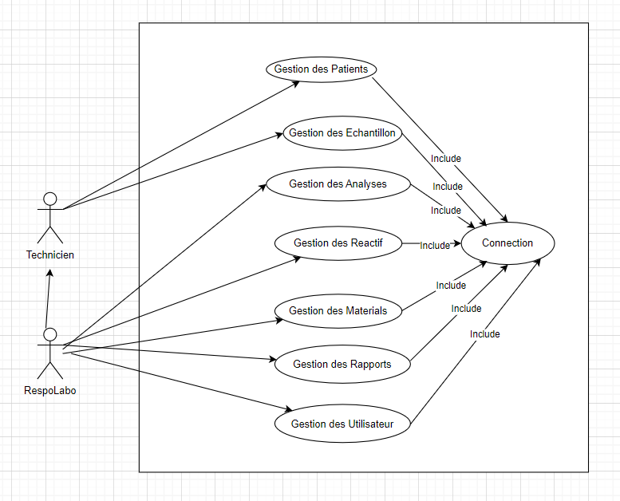

# LabXpert - Système de Gestion de Laboratoire

## Aperçu
LabXpert est un système complet de gestion de laboratoire médical développé en Java avec Spring Boot, intégrant une API RESTful et utilisant PostgreSQL comme base de données. L'application vise à améliorer l'efficacité et la précision dans le traitement des analyses médicales pour offrir un service plus rapide et plus précis aux patients.

## Fonctionnalités

1. **Enregistrement des Échantillons :**
   - Les techniciens peuvent enregistrer de nouveaux échantillons en spécifiant les informations pertinentes telles que le patient, le type d'analyse et la date de prélèvement.

2. **Suivi des Analyses en Cours :**
   - Interface conviviale pour suivre en temps réel l'état d'avancement des analyses en cours, avec des détails spécifiques pour chaque échantillon.

3. **Gestion des Résultats :**
   - Consignation systématique des résultats d'analyses pour un accès rapide et la possibilité de partager les résultats avec les professionnels de la santé concernés.

4. **Gestion des Patients :**
   - Module dédié pour gérer les informations relatives aux patients, assurant une centralisation des données et une navigation facilitée.

5. **Inventaire des Réactifs :**
   - Intégration d'un suivi des stocks pour garantir la disponibilité des réactifs nécessaires aux différentes analyses.

6. **Gestion des Utilisateurs :**
   - Interface d'administration pour gérer les droits d'accès et les informations des utilisateurs, assurant une sécurité accrue des données.

7. **Planification des Analyses :**
   - Possibilité de planifier les analyses en fonction de la charge de travail, optimisant ainsi l'utilisation des ressources du laboratoire.

8. **Rapports Statistiques :**
   - Génération de rapports statistiques pour évaluer les performances du laboratoire, identifier les tendances et prendre des décisions basées sur les données.

## Configuration du Projet
Le projet LabXpert est configuré pour construire une application robuste en utilisant Spring Boot, PostgreSQL, et JUnit 5 pour les tests.

## Diagramme UML

-Use cas:

-Class :

